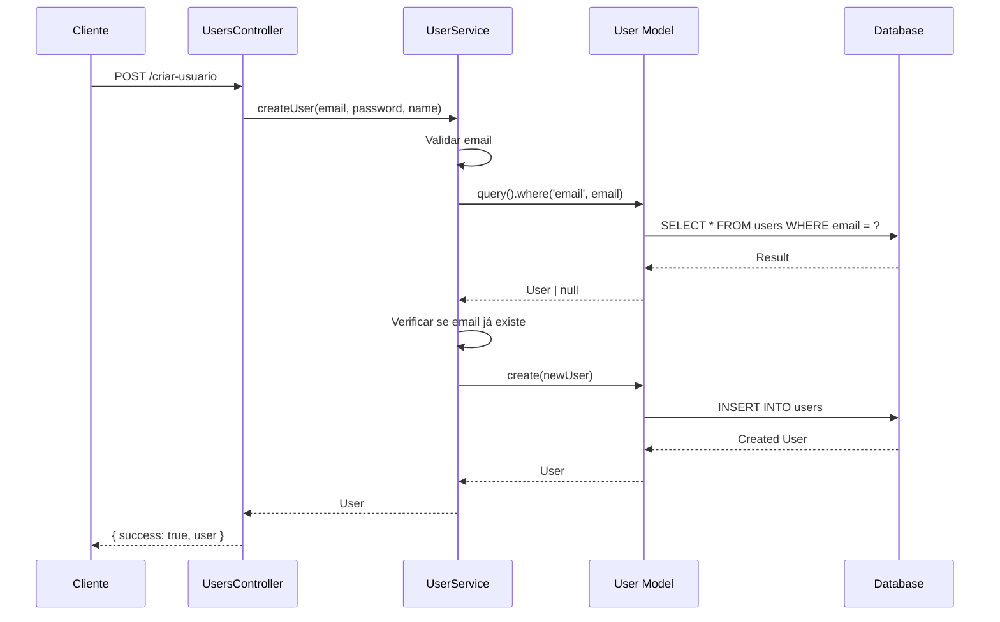
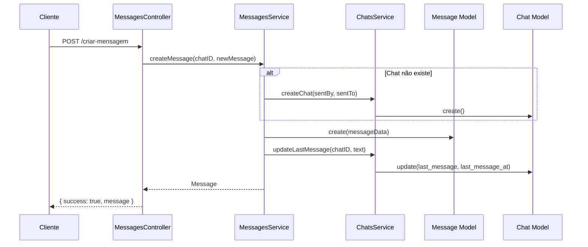

# Documentação da Arquitetura - Girls Chat API

## 📋 Índice

1. [Visão Geral](#visão-geral)
2. [Padrões Arquiteturais](#padrões-arquiteturais) 
3. [Estrutura de Camadas](#estrutura-de-camadas)
4. [Modelos de Dados](#modelos-de-dados)
5. [Controladores](#controladores)
6. [Serviços](#serviços)
7. [Fluxos Principais](#fluxos-principais)
8. [Tecnologias Utilizadas](#tecnologias-utilizadas)

## 🎯 Visão Geral

O **Girls Chat API** é uma aplicação de chat em tempo real construída com **AdonisJS** e **TypeScript**, seguindo uma arquitetura baseada em camadas que separa responsabilidades e facilita manutenção e escalabilidade.

### Características Principais
- ✅ API REST para operações CRUD
- ✅ WebSocket para comunicação em tempo real
- ✅ Autenticação de usuários
- ✅ Sistema de mensagens privadas
- ✅ Notificações
- ✅ Validações robustas

## 🏗️ Padrões Arquiteturais

### 1. **MVC (Model-View-Controller)**
```
📱 Cliente (View) ↔️ 🎮 Controller ↔️ 📊 Model ↔️ 🗄️ Database
```
- **Models**: Entidades de domínio (`User`, `Chat`, `Message`, `Notification`)
- **Controllers**: Lógica de apresentação e roteamento HTTP
- **Views**: Respostas JSON (API)

### 2. **Service Layer Pattern**
```
🎮 Controller → ⚙️ Service → 📊 Model
```
- Encapsula regras de negócio complexas
- Promove reutilização de código
- Facilita testes unitários

### 3. **Active Record Pattern (Lucid ORM)**
- Models contêm dados + comportamentos
- Relacionamentos via decorators
- Facilita operações CRUD

### 4. **Dependency Injection**
- Controllers recebem services via construtor
- Baixo acoplamento entre camadas

## 📚 Estrutura de Camadas

### **Camada de Apresentação** (`Controllers/`)
**Responsabilidades:**
- Receber requisições HTTP
- Validar parâmetros de entrada
- Delegar para camada de negócios
- Formatar respostas JSON
- Tratamento de erros HTTP

### **Camada de Negócios** (`Services/`)
**Responsabilidades:**
- Implementar regras de negócio
- Validações complexas
- Coordenar operações entre models
- Gerenciar transações
- Tratamento de erros de domínio

### **Camada de Dados** (`Models/`)
**Responsabilidades:**
- Mapear tabelas do banco
- Definir relacionamentos
- Validações básicas
- Queries customizadas

### **Camada de Utilitários** (`Utils/`)
**Responsabilidades:**
- Funções auxiliares reutilizáveis
- Validações genéricas
- Formatações

## 📊 Modelos de Dados

### **User** (Usuário)
```typescript
class User {
  id: number              // PK - Identificador único
  email: string           // Email único para login
  password: string        // Hash MD5 da senha
  name: string           // Nome do usuário
  lastLogin: DateTime    // Último acesso
  createdAt: DateTime    // Data de criação
  updatedAt: DateTime    // Última atualização
}
```

**Relacionamentos:**
- `hostedChats`: Chats onde é host (1:N)
- `participatingChats`: Chats onde participa (1:N)  
- `sentMessages`: Mensagens enviadas (1:N)
- `receivedMessages`: Mensagens recebidas (1:N)
- `notifications`: Suas notificações (1:N)

### **Chat** (Conversa)
```typescript
class Chat {
  id: number                // PK - Identificador único
  id_host: number          // FK - ID do usuário host
  participant: number      // FK - ID do participante
  last_message: string     // Última mensagem
  last_message_at: DateTime // Timestamp da última mensagem
  createdAt: DateTime      // Data de criação
  updatedAt: DateTime      // Última atualização
}
```

**Relacionamentos:**
- `host`: Usuário host (N:1)
- `participantUser`: Usuário participante (N:1)
- `messages`: Mensagens do chat (1:N)
- `notifications`: Notificações do chat (1:N)

### **Message** (Mensagem)
```typescript
class Message {
  id: number           // PK - Identificador único
  id_chat: number     // FK - ID do chat
  text: string        // Conteúdo da mensagem
  seen: boolean       // Status de visualização
  sentBy: number      // FK - ID do remetente
  sentTo: number      // FK - ID do destinatário
  createdAt: DateTime // Data de criação
  updatedAt: DateTime // Última atualização
}
```

### **Notification** (Notificação)
```typescript
class Notification {
  id: number           // PK - Identificador único
  id_chat: number     // FK - ID do chat relacionado
  id_user: number     // FK - ID do usuário destinatário
  text: string        // Conteúdo da notificação
  seen: boolean       // Status de visualização
  createdAt: DateTime // Data de criação
  updatedAt: DateTime // Última atualização
}
```

## 🎮 Controladores

### **UsersController**
**Endpoints:**
- `POST /criar-usuario` → `signUp()` - Cadastro de usuário
- `POST /login` → `login()` - Autenticação
- `GET /usuarios` → `index()` - Listar usuários (exceto atual)
- `PUT /atualizar-usuario/:id` → `update()` - Atualizar perfil

### **ChatsController**  
**Endpoints:**
- `POST /chats` → `index()` - Listar chats do usuário
- `GET /chat` → `show()` - Detalhes de um chat
- `POST /criar-chat` → `create()` - Criar novo chat

### **MessagesController**
**Endpoints:**
- `GET /mensagens` → `index()` - Mensagens de um chat
- `POST /criar-mensagem` → `create()` - Enviar mensagem
- `PUT /atualizar-status-visto` → `updateSeenStatus()` - Marcar como visto

## ⚙️ Serviços

### **UserService**
**Métodos principais:**
```typescript
// Autenticação
getUserByEmailAndPassword(email: string, password: string): Promise<User>

// Gestão de usuários
createUser(email: string, password: string, name: string): Promise<User>
updateUser(userID: string, updatedData: any): Promise<User>
getAllUsersExcept(userID: string|number): Promise<User[]>
```

### **ChatsService**
**Métodos principais:**
```typescript
// Listagem e visualização
getUserChats(userID: string): Promise<Chat[]>
showChat(chatID: string): Promise<Chat>

// Gestão de chats
createChat(host: string, participant: string): Promise<Chat>
existsChatBetweenUsers(userA: string, userB: string): Promise<boolean>
updateLastMessage(chatID: string, messageText: string): Promise<void>
```

### **MessagesService**
**Métodos principais:**
```typescript
// Mensagens
getMessagesByChatID(chatID: string): Promise<Message[]>
createMessage(chatID: string|number, newMessage: object): Promise<Message>
updateMessageSeenStatus(chatID: string): Promise<void>
```

## 🔄 Fluxos Principais

### **1. Cadastro de Usuário**


### **2. Envio de Mensagem**


## 🛠️ Tecnologias Utilizadas

### **Backend Framework**
- **AdonisJS 5** - Framework Node.js full-stack
- **TypeScript** - Tipagem estática
- **Lucid ORM** - Mapeamento objeto-relacional

### **Database**
- **PostgreSQL** - Banco de dados relacional
- **Migrations** - Controle de versão do schema

### **Comunicação**
- **HTTP/REST** - APIs tradicionais
- **Socket.IO** - WebSocket para tempo real

### **Validação & Segurança**
- **MD5** - Hash de senhas (js-md5)
- **Email Validation** - Regex personalizada
- **CORS** - Configurado para cross-origin

### **Testes**
- **Japa** - Framework de testes do AdonisJS
- **Database Transactions** - Isolamento de testes

## 📈 Vantagens da Arquitetura

### ✅ **Separação de Responsabilidades**
- Cada camada tem função bem definida
- Fácil localização de bugs
- Manutenção simplificada

### ✅ **Escalabilidade**
- Services podem ser extraídos para microserviços
- Models independentes facilitam sharding
- Controllers podem ser versionados

### ✅ **Testabilidade**
- Services isolados são facilmente testáveis
- Mocks de dependências simplificados
- Transações de teste isolam dados

### ✅ **Reutilização**
- Services podem ser usados por múltiplos controllers
- Utilities compartilhadas
- Relacionamentos ORM reutilizáveis

### ✅ **Manutenibilidade**
- Código organizado por domínio
- TypeScript previne erros de tipo
- Padrões consistentes em todo projeto