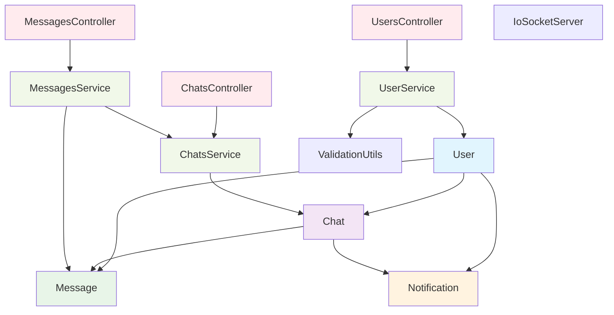
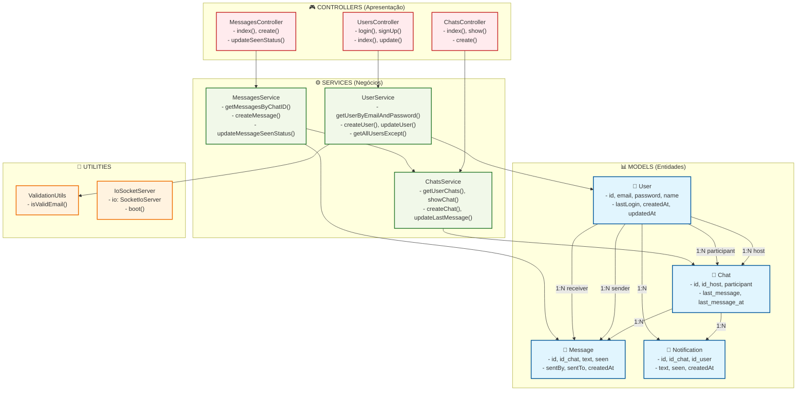
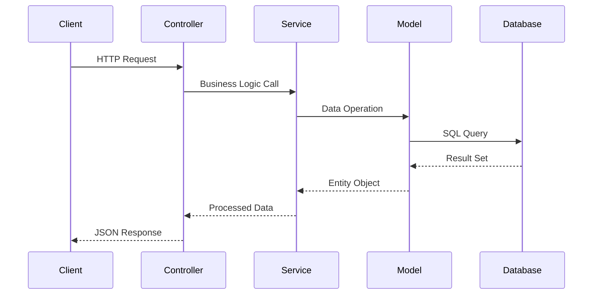

# Diagrama de Classes Simplificado - Girls Chat API

## Estrutura Principal das Classes

## Resumo dos Relacionamentos

| Model | Relacionamentos |
|-------|----------------|
| **User** | • Hospeda vários Chats (1:N) • Participa de vários Chats (1:N) • Envia/Recebe Mensagens (1:N) • Possui Notificações (1:N) |
| **Chat** | • Pertence a 2 Users (N:1) • Contém Mensagens (1:N) • Gera Notificações (1:N) |
| **Message** | • Pertence a 1 Chat (N:1) • Enviada por 1 User (N:1) • Recebida por 1 User (N:1) |
| **Notification** | • Pertence a 1 Chat (N:1) • Destinada a 1 User (N:1) |

## Fluxo de Dados

